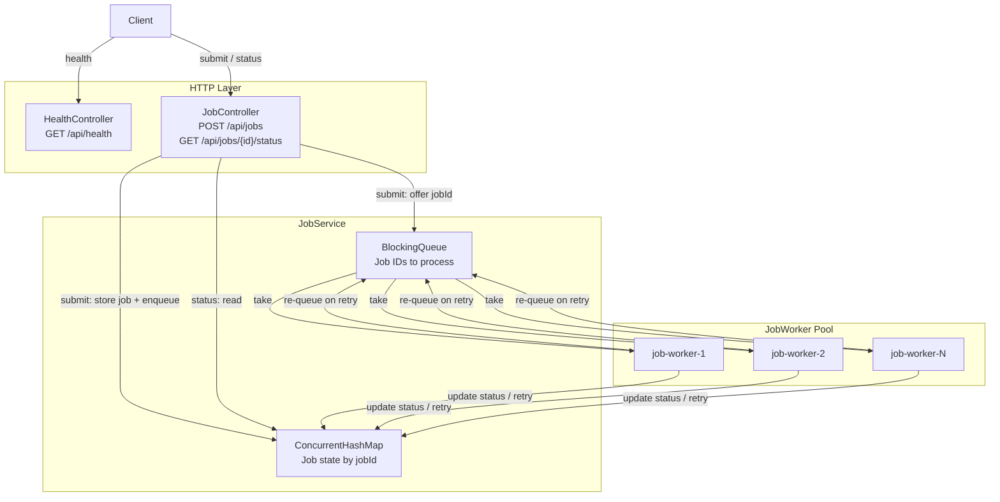
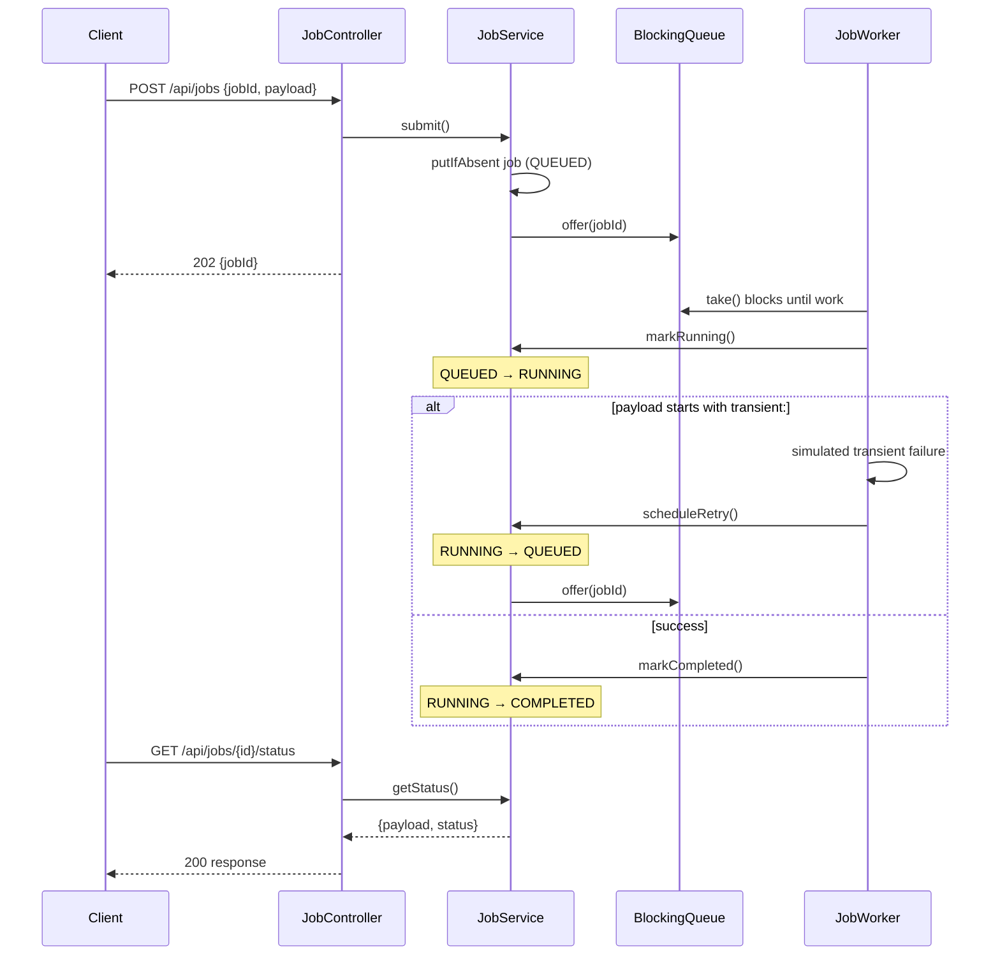
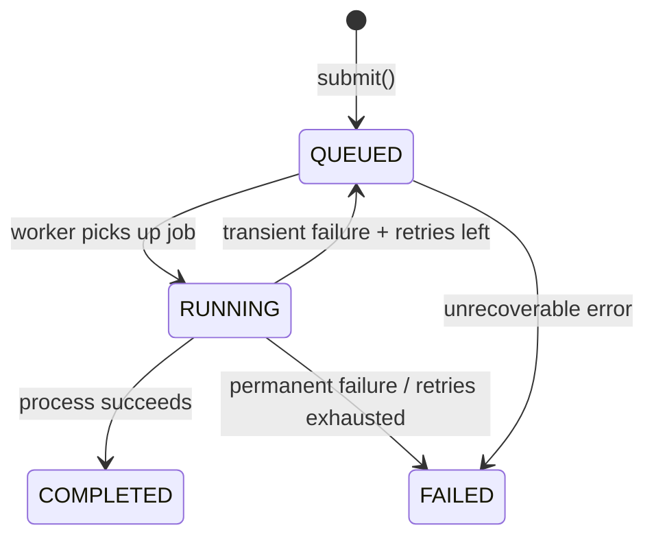

# Async Batch Job REST API

Spring Boot REST API for submitting asynchronous batch jobs, polling status, and processing work in a background worker pool with retry support for simulated transient failures.

## Prerequisites

- **Java 21**
- **Git** (optional, for cloning)
- Maven is **not** required locally — the project includes the Maven Wrapper (`mvnw`)

## Setup

```bash
git clone https://github.com/Lokicooldude/AsyncBatchJob.git
cd AsyncBatchJob
```

No additional dependencies or database setup is required.

## Running the application

From the project root:

```bash
chmod +x mvnw
./mvnw spring-boot:run
```

The server starts on **http://localhost:8080**.

### Dev container / remote environment

If you run the app inside a dev container (for example Cursor or VS Code), `localhost:8080` on your host machine may not reach the server directly. Either:

- Run `curl` from the **integrated terminal** inside the container, or
- Forward port **8080** using the editor's **Ports** panel

## API

### Health check

```bash
curl http://localhost:8080/api/health
```

Response:

```json
{ "status": "UP" }
```

### Submit a job

```bash
curl -X POST http://localhost:8080/api/jobs \
  -H "Content-Type: application/json" \
  -d '{"jobId": 42, "payload": "my-task"}'
```

Response (`202 Accepted`):

```json
{ "jobId": 42 }
```

| Field | Required | Description |
|-------|----------|-------------|
| `jobId` | Yes | Positive integer, client-provided unique job identifier |
| `payload` | No | Optional task data (max 1000 characters) |

### Get job status

```bash
curl http://localhost:8080/api/jobs/42/status
```

Response:

```json
{ "payload": "my-task", "status": "RUNNING" }
```

Status values: `QUEUED` → `RUNNING` → `COMPLETED` or `FAILED`

## Simulated transient failures

By default, normal payloads process successfully on the first attempt.

To simulate transient failures and retries, prefix the payload with `transient:`:

```bash
curl -X POST http://localhost:8080/api/jobs \
  -H "Content-Type: application/json" \
  -d '{"jobId": 100, "payload": "transient:flaky-task"}'
```

The worker fails the first N attempts (configurable), re-queues the job, and eventually completes or marks it `FAILED` when retries are exhausted.

## Configuration

Settings in `src/main/resources/application.properties`:

| Property | Default | Description |
|----------|---------|-------------|
| `server.port` | `8080` | HTTP port |
| `job.processing.queued-delay-ms` | `2000` | Delay while job is `QUEUED` before moving to `RUNNING` |
| `job.processing.running-delay-ms` | `3000` | Delay while job is `RUNNING` before processing completes |
| `job.processing.simulated-transient-failures` | `2` | Attempts that fail for `transient:` payloads |
| `job.processing.max-retries` | `3` | Max processing attempts before permanent failure |
| `job.processing.worker-count` | `4` | Background worker threads |

## Running tests

```bash
./mvnw test
```

Test layout:

- `src/test/java/.../unit/` — unit tests (model, service, controller slice)
- `src/test/java/.../integration/` — full Spring context and worker integration tests

Run subsets:

```bash
./mvnw test -Dtest="com.example.restapi.unit.**"
./mvnw test -Dtest="com.example.restapi.integration.**"
```

## CI

GitHub Actions runs `./mvnw -B test` on push and pull requests to `main` / `master`.

Workflow file: `.github/workflows/ci.yml`

## Architecture

### Component overview



### Job lifecycle



### Job state machine



### Concurrency model

| Component | Role |
|-----------|------|
| **ConcurrentHashMap** | Thread-safe job storage; atomic duplicate detection on submit (`putIfAbsent`) |
| **BlockingQueue** | Producer–consumer handoff from HTTP threads to worker threads |
| **Synchronized `Job`** | Safe status transitions (`QUEUED` → `RUNNING` → `COMPLETED` / `FAILED`) |
| **Worker pool** | Multiple threads call `take()`; each job ID is processed by one worker at a time |

## Known limitations

1. **In-memory only** — jobs are stored in memory. All state is lost when the application restarts.
2. **Single instance** — not designed for horizontal scaling across multiple app instances without an external queue and shared storage.
3. **Client-provided job IDs** — duplicate `jobId` submissions are rejected, but IDs are not persisted across restarts.
4. **Simulated failures only** — transient errors are simulated via the `transient:` payload prefix, not real external failure modes.
5. **Artificial delays** — `queued-delay-ms` and `running-delay-ms` are for demonstration and easier status polling; remove or reduce them in production.
6. **No authentication** — the API is open with no auth or rate limiting.
7. **No persistence layer** — no database, message broker, or durable queue (Redis, SQS, RabbitMQ, etc.).
8. **Worker pool processes in-process** — workers run inside the same JVM as the web server; a crash stops both API and processing.

## Tech stack

- Java 21
- Spring Boot 3.5
- Spring Web + Validation
- JUnit 5 + MockMvc
